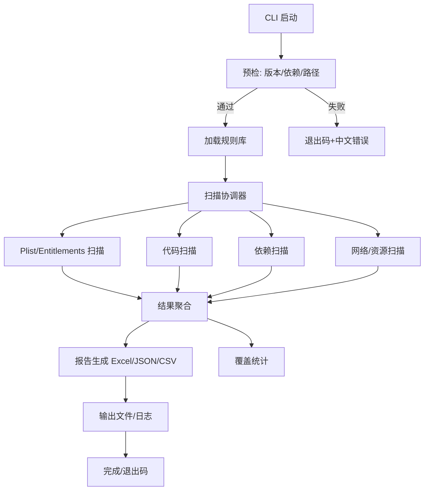

# iOS App Store 合规扫描器架构

## 背景与目标
- 离线运行的命令行工具，基于 App Store Review Guidelines 与 HIG 扫描 iOS 客户端（Swift/ObjC）项目，输出中文报告（Excel，支持 JSON/CSV）。
- 强调规则库可扩展、高置信/人工复核标记，日志可配置（默认 1s，调试可至 30ms），Python 2.7.18 兼容，依赖 libclang。

## 约束
- 平台：macOS，Python 2.7.18；离线运行；可用 Homebrew 安装 clang/llvm。
- 语言生态：Python 2.x 第三方库受限，需锁定兼容版本（如 pandas/openpyxl）。
- 资源限制：忽略 build/DerivedData/Pods/.git/node_modules 等目录，默认跳过超大文件（如 >2MB，可配）。

## 模块与职责
- CLI 层：参数解析（路径、规则分组、输出格式、日志间隔、verbose/debug）；预检环境（Python 版本、依赖、libclang 可用性、路径存在）；统一退出码。
- 扫描协调器：根据规则分组调度各扫描器；管理并发/范围过滤；聚合结果。
- 规则库：YAML/JSON，规则ID（PRIV/PAY/AUTH/NET/API/META），条款链接、风险级、证据提示、高置信/人工复核标记、版本/变更记录。
- 扫描器：
  - plist/entitlements：权限文案、ATS、后台模式、Sign in with Apple、URL Schemes、导出合规。
  - 代码：Swift/ObjC 静态扫描（libclang/SourceKitten 可选），ATT/跟踪 SDK、IDFA 访问、StoreKit/IAP、外链支付/第三方支付 SDK、第三方登录 vs Apple 登录、私有 API/反射黑名单、明文 HTTP、后台模式实现。
  - 依赖：Podfile/Package.swift/SwiftPM，识别 SDK 类型（广告/支付/登录）。
  - 网络/资源：HTTP 链接、ATS 例外域（可与代码扫描合并）。
  - 人工复核提示：UGC/订阅条款/描述截图等。
- 报告生成：默认 Excel（风险配色红/黄/绿，排序：风险降序、规则ID 升序；覆盖统计 Sheet）；可选 JSON/CSV；证据包含文件/行/片段、中文理由与建议。
- 日志与错误：中文输出；可配置日志频率，模块级阶段汇总；明确错误码与解决提示。

## 流程

## 数据模型（示意）
- Rule：`id`、`title`、`source_link`、`section`、`group`、`severity`、`confidence`（high/manual）、`applicability`、`suggestion_template`、`version`、`changelog`.
- Finding：`rule_id`、`severity`、`file`、`line`、`evidence`、`reason`、`suggestion`、`needs_review`、`group`.
- Report：`findings`、`coverage_stats`、`formats`（excel/json/csv）。

## 技术选型
- Python 2.7.18；pandas + openpyxl（锁版本）；yaml/JSON 解析；argparse 处理 CLI。
- 静态分析：libclang（clang.cindex）优先；SourceKitten 可选（需评估 2.7 兼容性，可能使用命令行输出解析）。
- 日志：logging，支持自定义 handler 控制频率；长任务可用简单计时 + 周期输出。

## 关键决策与风险
- Python 2.7 兼容性：需确认依赖可用版本；若 SourceKitten 交互困难，退化为 libclang + 正则/符号扫描。
- 日志频率 30ms：默认 1s，可配置，debug 时提示 I/O 开销。
- 规则库维护：需提供版本/变更记录，避免扫描器与规则不一致。
- 并发与性能：可配置线程数；默认过滤大文件与二进制，避免性能瓶颈。

## 待办/下一步
- 验证 Python 2.7 可用的 pandas/openpyxl/libclang 版本；确定 SourceKitten 方案。
- 确定规则库初始示例与分组；定义规则/结果的 JSON Schema。
- 编写 CLI 与预检骨架；实现 plist 扫描 + 报告骨架作为第一迭代。
