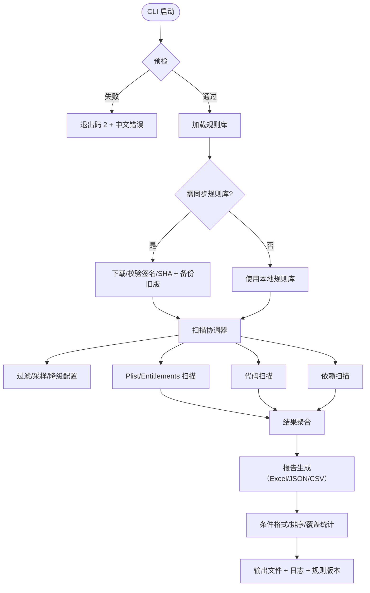

# Architecture for iOS App Store 合规扫描器

Status: Draft

## Technical Summary
离线 CLI 工具，基于可扩展规则库扫描 iOS 客户端（Swift/ObjC）源码与配置（Info.plist/Entitlements/Podfile/Package.swift），检测与 App Store Review Guidelines 与 HIG 相关的高置信风险并输出中文报告。依赖 Python 2.7.18、libclang（clang.cindex）为主链，SourceKitten 备选，报告以 Excel 为主（条件格式/排序/覆盖统计），可选 JSON/CSV；预检/日志可诊断，默认过滤编译产物和大文件，支持进程池并发与正则降级。

## Technology Table
| Technology | Description |
| ---------- | ----------- |
| Python 2.7.18 | 主语言；需锁定 pandas 0.24.2/openpyxl 2.6.4 等兼容版本 |
| libclang/llvm 14 | Swift/ObjC 解析（clang.cindex）；macOS 上通过 Homebrew 安装 |
| SourceKitten 0.34.x | Swift 解析备选，libclang 失败时回退，输出 JSON 供正则/符号匹配 |
| argparse/logging | CLI 参数解析与日志（可配置频率、阶段汇总、错误码） |
| pandas + openpyxl | Excel 报告生成（红/黄/绿条件格式、排序、覆盖统计） |
| YAML/JSON | 规则库存储、加载与校验（含版本/签名/测试用例） |

## Architectural Diagrams


## Data Models, API Specs, Schemas, etc.
- Rule：`id`、`group`（PRIV/PAY/AUTH/NET/API/META）、`title`、`guideline_links[]`、`section`、`severity`、`confidence{high/manual}`、`needs_review_default`、`suggestion_template`、`evidence_hint`、`version`、`changelog`、`signature/sha256`、`tests`（示例工程路径、期望结果）。
- Finding：`rule_id`、`group`、`severity`、`file`、`line`、`evidence`、`reason`、`suggestion`、`needs_review`、`confidence`、`scanner`、`evidence_snippet_len`。
- Report：`findings`、`coverage_stats`、`formats`（excel/json/csv）、`meta`（项目路径、Git commit、扫描时间、规则版本、工具版本、耗时、扫描文件数、跳过原因）。

## Project Structure
```text
.ai/
  prd/                       # PRD
  stories/                   # 用户故事
  architecture/              # 架构文档
scanner/
  rules/                     # 机读规则库（YAML/JSON，版本/分组/条款链接、签名、测试用例）
  scanners/                  # 模块化扫描器（plist.py/code.py/deps.py/…）
  coordinator.py             # 扫描调度与聚合（并发/过滤/降级）
  cli.py                     # CLI 入口与预检（参数、依赖检查、错误码）
  report/                    # 报告生成（Excel/JSON/CSV，覆盖统计与元信息）
  logging_utils.py           # 日志与频率控制（节流、阶段汇总）
```

## Infrastructure
- 运行环境：macOS 12+，本地执行；需 Homebrew 安装 llvm@14/libclang，可探测 brew 路径。
- 依赖管理：Python 2.7.18 环境，锁定 pandas 0.24.2/openpyxl 2.6.4/PyYAML 5.4.x；提供离线 wheel；预检校验版本。
- 语法覆盖：Swift 5.7-/ObjC（ARC/MRC）；宏/模板复杂场景降级正则并标记 `needs_review`。
- 无服务端部署需求，仅本地工具分发。

## Deployment Plan
- 安装依赖：Homebrew 安装 llvm@14；安装锁定版本的 Python 包（可离线 wheel）。
- 配置：CLI 参数 `--project-path`、`--output-format(s)`、`--include/--exclude`、`--max-file-size`、`--workers`、`--log-interval`。
- 预检：校验 Python/依赖/libclang/路径；失败给出中文错误与退出码 2。
- 分发：打包脚本/安装指南，附示例项目与示例报告验证；`--validate-rules` 校验规则库。

## Operational Notes
- 错误码：0 成功；1 扫描发现高/中风险；2 预检失败；3 执行异常（依赖缺失/解析失败/IO 错误）。
- 日志：中文，阶段汇总包含扫描文件数/跳过原因/耗时分位；节流默认 1s，可调到 200ms（低于时提示 I/O 风险）。
- 并发/性能：默认进程池 min(4, CPU 核心)；大文件阈值 5MB；单文件超过 3s 触发降级正则并标记 `needs_review`。
- 证据策略：截取上下文（默认 5-10 行，最长 500 字符）；存储规则版本与签名，报告中写入。
- 输出：默认 `reports/{project_name}-{timestamp}/`，包含 `report.xlsx`、可选 `report.json/csv`、`scan.log`、`rules-version.txt`。

## Change Log
| Change | Story ID | Description |
| ------ | -------- | ----------- |
| 初稿   | N/A      | 基于 PRD 与概览生成架构设计 |
| 审阅补充 | N/A | 精简流程图、补充规则/报告元信息、配置/日志/错误码、并发与降级策略 |
| 流程图修复 | N/A | 修正 Mermaid 语法，重新绘制流程 |
| 流程图重绘 | N/A | 重画流程图，确保 Mermaid 通过渲染 |
