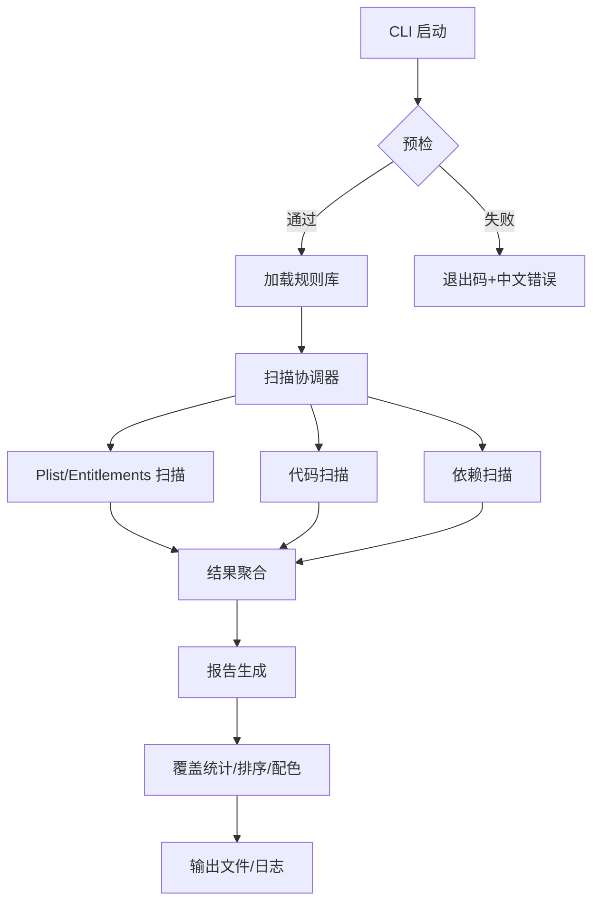

# Architecture for iOS App Store 合规扫描器

Status: Draft

## Technical Summary
离线运行的 CLI 工具，基于可扩展的规则库扫描 iOS 客户端（Swift/ObjC）源码与配置（Info.plist/Entitlements/Podfile/Package.swift），检测与 App Store Review Guidelines 与 HIG 相关的高置信风险并输出中文报告。依赖 Python 2.7.18、libclang（clang.cindex）完成静态扫描，报告以 Excel 为主，可选 JSON/CSV，日志/预检可诊断，默认过滤编译产物和大文件。

## Technology Table
| Technology | Description |
| ---------- | ----------- |
| Python 2.7.18 | 主语言；需锁定 pandas/openpyxl 等兼容版本 |
| libclang/llvm | Swift/ObjC 解析（clang.cindex）；macOS 上通过 Homebrew 安装 |
| argparse/logging | CLI 参数解析与日志（支持可配置频率、阶段汇总） |
| pandas + openpyxl | Excel 报告生成（红/黄/绿条件格式、排序、覆盖统计） |
| YAML/JSON 解析 | 规则库存储、加载与校验 |

## Architectural Diagrams


## Data Models, API Specs, Schemas, etc.
- Rule：`id`、`group`（PRIV/PAY/AUTH/NET/API/META）、`title`、`source_link`、`section`、`severity`、`confidence`（high/manual）、`suggestion_template`、`version`、`changelog`。
- Finding：`rule_id`、`severity`、`file`、`line`、`evidence`、`reason`、`suggestion`、`needs_review`、`group`。
- Report：`findings`、`coverage_stats`、`formats`（excel/json/csv）。

## Project Structure
```text
.ai/
  prd/                       # PRD
  stories/                   # 用户故事
  architecture/              # 架构文档
scanner/
  rules/                     # 机读规则库（YAML/JSON，版本/分组/条款链接）
  scanners/                  # 模块化扫描器（plist.py/code.py/deps.py/…）
  coordinator.py             # 扫描调度与聚合
  cli.py                     # CLI 入口与预检
  report/                    # 报告生成（Excel/JSON/CSV）
  logging_utils.py           # 日志与频率控制
```

## Infrastructure
- 运行环境：macOS，本地执行；需 Homebrew 安装 llvm/libclang。
- 依赖管理：Python 2.7.18 环境，锁定 pandas/openpyxl 等版本；离线安装包准备。
- 无服务端部署需求，仅本地工具分发。

## Deployment Plan
- 安装依赖：Homebrew 安装 llvm；安装锁定版本的 Python 包（可离线 wheel）。
- 配置：通过 CLI 传入项目路径、输出格式、日志频率、include/exclude。
- 预检：运行前校验 Python/依赖/libclang/路径，失败给出中文错误与退出码。
- 分发：打包脚本/安装指南，附示例项目与示例报告验证。

## Change Log
| Change | Story ID | Description |
| ------ | -------- | ----------- |
| 初稿   | N/A      | 基于 PRD 与概览生成架构设计 |
